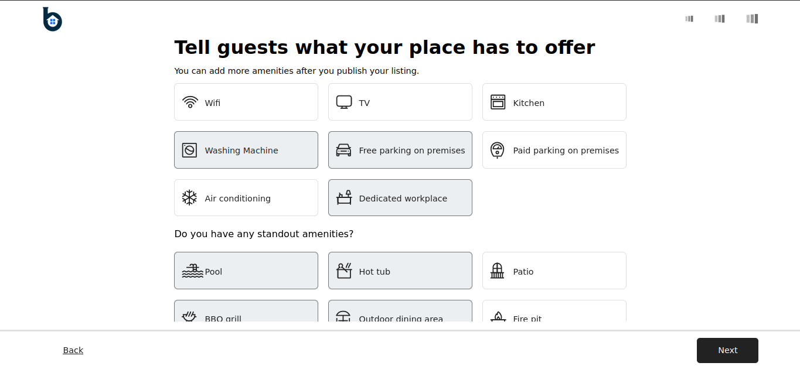

<a name="readme-top"></a>

<div align="center">
  

  
  
  
  
  
  
  
  
  
  

  <br/>
  <h3><b>BetLembosa</h3>
</div>
# 📗 Table of Contents

- [📗 Table of Contents](#-table-of-contents)
- [📖 BetLembosa ](#-betlembosa-)
  - [🛠 Built With ](#-built-with-)
    - [Tech Stack ](#tech-stack-)
    - [Key Features ](#key-features-)
  - [🚀 Live Demo ](#-live-demo-)
  - [💻 Getting Started ](#-getting-started-)
    - [Prerequisites](#prerequisites)
    - [Setup](#setup)
    - [Install](#install)
    - [Usage](#usage)
    - [Run tests](#run-tests)
    - [Deployment](#deployment)
  - [👥 Authors ](#-authors-)
  - [🔭 Future Features ](#-future-features-)
  - [🤝 Contributing ](#-contributing-)
  - [⭐️ Show your support ](#️-show-your-support-)
  - [🙏 Acknowledgments ](#-acknowledgments-)
  - [📝 License ](#-license-)

<!-- PROJECT DESCRIPTION -->

# 📖 BetLembosa <a name="about-project"></a>

**BetLembosa**is a user-friendly web app that allows property owners to create and manage home listings, while guests can reserve rooms or entire properties. It offers integrated online payment through Stripe for secure transactions and features an interactive map to help users find and locate accommodations. The app ensures a seamless experience for both hosts and travelers, providing easy updates to listings and convenient booking capabilities.


## 🛠 Built With <a name="built-with"></a>
- Frontend: Next.js 14
- Backend: Node.js, Express
- Database: MongoDB
- API Fetching: Axios
- Payment Integration: Stripe
- Authentication: JWT (JSON Web Tokens)
### Tech Stack <a name="tech-stack"></a>
<details>
  <summary>Client</summary>
  <ul>
    <li><a href="https://nextjs.org/">Next.js 14</a></li>
  </ul>
</details>
<details>
  <summary>Server</summary>
  <ul>
     <li><a href="https://jwt.io/">JWT</a></li>
      <li><a href="https://dotnet.microsoft.com/en-us/apps/aspnet/">Aps.Net</a></li>
  </ul>
</details>

<details>
<summary>Database</summary>
  <ul>
    <li><a href="https://www.postgresql.org//">PostgreSql</a></li>
  </ul>
</details>

<!-- Features -->

### Key Features <a name="key-features"></a>

- **Home Page:** Browse and discover available properties.
- **Detail Page:** View detailed information about specific properties, including photos, amenities, and location.
- **Trip Page:** Manage and view upcoming trips and bookings.
- **Wishlist Page:** Save favorite properties for future reference.
- **Secure Online Payments:** Integrated Stripe for secure transactions.
- **Authentication:** User authentication and authorization using JWT.

<p align="right">(<a href="#readme-top">back to top</a>)</p>

<!-- LIVE DEMO -->

## 🚀 Live Demo <a name="live-demo"></a>
- Coming Soon

<p align="right">(<a href="#readme-top">back to top</a>)</p>

<!-- GETTING STARTED -->

## 💻 Getting Started <a name="getting-started"></a>

To get a local copy up and running, follow these steps.

### Prerequisites
In order to run this project you need:
1. NextJs14
2. Nodejs
3. npm Package manager
4. dotnet core

### Setup

Clone this repository to your desired folder:

```bash
  git clone https://github.com/Paul-tes/BetLembosa-Share-Rooms.git
```

### Install

Install this project with:

Run this command:

```bash
  cd BetLembosa-Share-Rooms
  npm install
```

### Usage

To run the project, execute the following command:

Example command:

```bash
  npm run dev
```

### Run tests

To run tests, run the following command:

```bash
  npm test
```

### Deployment

You can deploy this project using:
 - Commin Soon

<p align="right">(<a href="#readme-top">back to top</a>)</p>

## 👥 Authors <a name="authors"></a>


👤 **Pawlos Tesfaye**

- GitHub: [@ragangithub](https://github.com/paul-tes)
- LinkedIn: [ragan-hailu-318640228](https://www.linkedin.com/in/paul-tesfaye-687820215/)

<p align="right">(<a href="#readme-top">back to top</a>)</p>

<!-- FUTURE FEATURES -->

## 🔭 Future Features <a name="future-features"></a>

- [ ] **Complex Booking Management:** More detailed and customizable booking options.
- [ ] **Graphical Data Visualization:** Insights and statistics for hosts.
- [ ] **Responsiveness:** Enhanced mobile experience.
- [ ] **Real Time Chat:** Users allow to chat on a real time to another user.
- [ ] **Rating & feedback:** Enhance the Host to have a rating and fedback from room visited users.

<p align="right">(<a href="#readme-top">back to top</a>)</p>

<!-- CONTRIBUTING -->

## 🤝 Contributing <a name="contributing"></a>

Contributions, issues, and feature requests are welcome!

Feel free to check the [issues page](../../issues/).

<p align="right">(<a href="#readme-top">back to top</a>)</p>

<!-- SUPPORT -->

## ⭐️ Show your support <a name="support"></a>

If you like this project give me start on my repo.

<p align="right">(<a href="#readme-top">back to top</a>)</p>

<!-- ACKNOWLEDGEMENTS -->

## 🙏 Acknowledgments <a name="acknowledgements"></a>

I would like to thank Instructor Kedir, Who was my instructor and support me for doing this project.

<p align="right">(<a href="#readme-top">back to top</a>)</p>


<p align="right">(<a href="#readme-top">back to top</a>)</p>

<!-- LICENSE -->

## 📝 License <a name="license"></a>

This project is [MIT](./MIT.md) licensed.

<p align="right">(<a href="#readme-top">back to top</a>)</p>
